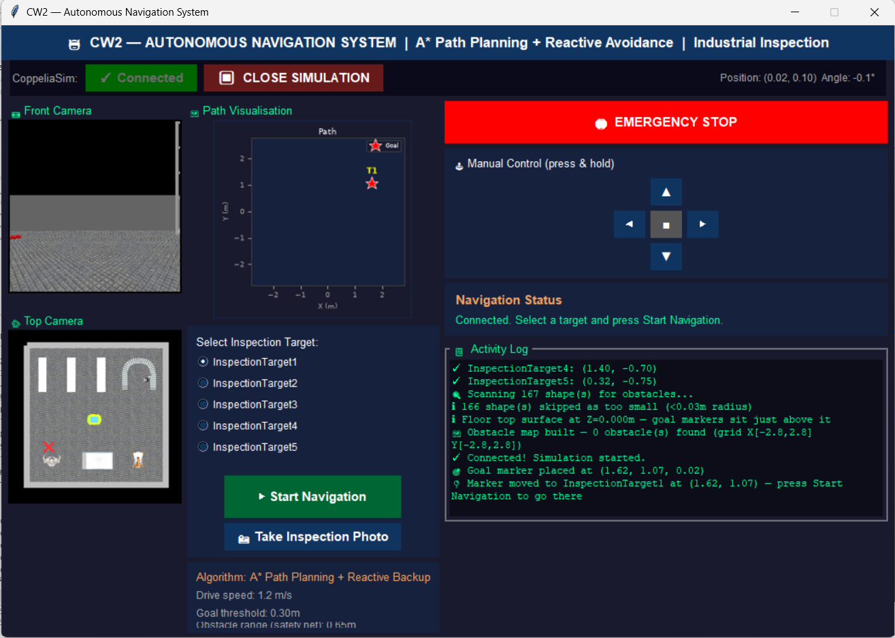
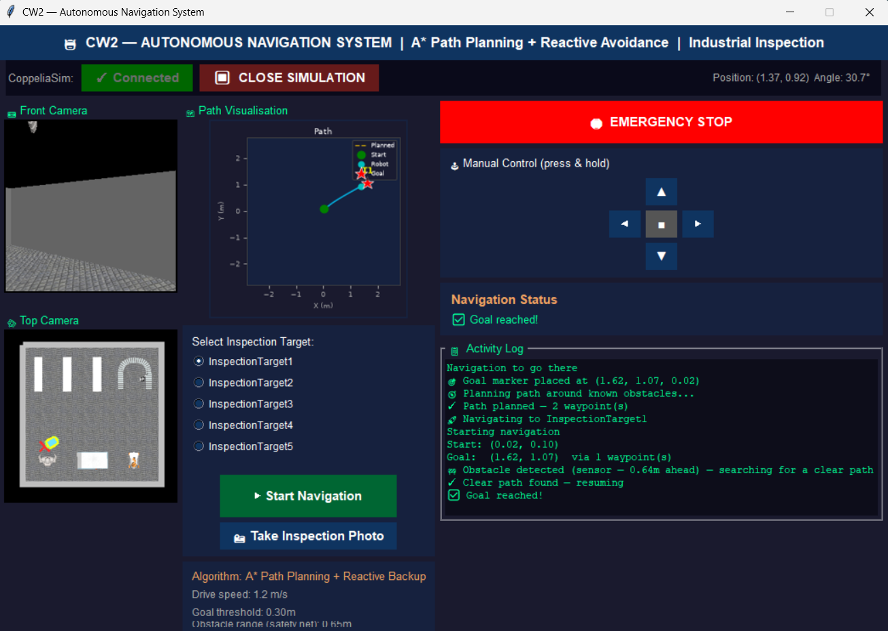
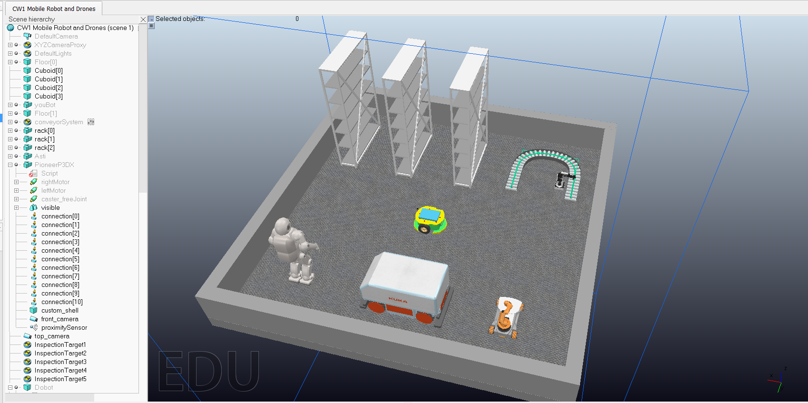

# Autonomous Navigation for a Mobile Robot (Industrial Inspection)

**Module:** 6FTC2061 Mobile Robots and Drones – Coursework 2
**Tools:** Python, CoppeliaSim EDU, ZMQ Remote API, Tkinter

For this coursework I built a navigation system for a Pioneer P3-DX robot in a small simulated warehouse. You pick an inspection point in the GUI, and the robot plans a route around the racks and other equipment using A*, drives there, and re-plans by itself if something gets in the way.



## What it does

- **Scans the scene at startup** to build an obstacle map. The robot and floor are skipped, and so are tiny parts (bolts, decals) and huge ones (walls, room shell).
- **Plans a path with A\*** on a 0.08 m grid. Obstacles are inflated by the robot radius plus a safety margin, so the robot can be treated as a single point.
- **Smooths the path** by removing waypoints whenever there is a clear straight line further ahead. That leaves a few long segments instead of zig-zagging cell to cell.
- **Re-plans when blocked.** If the proximity sensor or the map says something is in front, it re-runs A* from where the robot is. If there's still no route, it turns on the spot while retrying, and switches turn direction if that takes too long.
- **Motion control** switches between pivoting in place (large heading error) and driving forward with steering correction (small error). Wheel speeds are rate-limited so the motion stays smooth.
- **Operator GUI** with live front and top camera feeds, a live path plot, target selection, manual D-pad control, emergency stop, inspection photo capture and an activity log.



*Yellow dashed line = planned A\* route, cyan = path the robot actually drove, red star = goal.*

## The scene



The warehouse has three racks, a conveyor, a KUKA mobile base, a robot arm and a human figure. There are five named `InspectionTarget` points for the robot to visit.

## How to run

1. Install the Python packages:
   ```
   pip install -r requirements.txt
   ```
2. Open `scene/CW2_Mobile_Robot_and_Drones.ttt` in CoppeliaSim. Leave the simulation **stopped**, because the script starts it itself.
3. Run:
   ```
   python navigation.py
   ```
4. Click **CONNECT & START SIMULATION**, pick a target, then click **Start Navigation**.

Inspection photos get saved to an `inspection_photos/` folder next to wherever you run the script.

## Key parameters

| Parameter | Value |
|---|---|
| Drive speed | 1.2 |
| Turn speed | 1.0 |
| Goal threshold | 0.30 m |
| Obstacle safety range (sensor) | 0.65 m |
| Robot footprint radius | 0.22 m |
| Obstacle inflation (radius + pad) | 0.32 m |
| A* grid cell | 0.08 m |

## Problems I ran into

- **Obstacles were way too big on the map.** At first I modelled each object as a circle based on its bounding box diagonal. Long shelves turned into huge blobs and blocked floor space the robot could actually use. I switched to rectangles that take the object's rotation into account, and after that the map matched the top camera view much better.
- **Robot spinning forever in pivot mode.** Sometimes the heading error never dropped below the exit threshold, so the robot just kept turning. I added a timeout: after 4 seconds of pivoting, it gives up and drives forward with steering correction instead.
- **Proximity sensor false triggers.** The sensor kept reporting an obstacle that wasn't on the map, most likely because it was picking up the robot's own body. Now, when a sensor-only trigger happens, it re-plans once and then ignores the sensor for a short cooldown.
- **Thread safety.** The ZMQ Remote API isn't thread-safe, and I have separate threads for the cameras, the pose and navigation. So every `sim.*` call goes through one lock.

## Limitations

- It uses the ground-truth pose from CoppeliaSim, not odometry or SLAM. The focus of the coursework was planning and control.
- The map is built once at startup, so only the sensor can catch things that move afterwards, like the human figure.
- There's only one forward-facing proximity sensor, so the robot can't see obstacles beside or behind it.

If I took this further, I'd swap the ground-truth pose for odometry + IMU, and build the grid from a LiDAR/SLAM map instead of reading it from the scene.

---

© 2026 Sudharsan Vijaya Kumaran. All rights reserved.
Developed as coursework for 6FTC2061 Mobile Robots and Drones (University of Hertfordshire).
